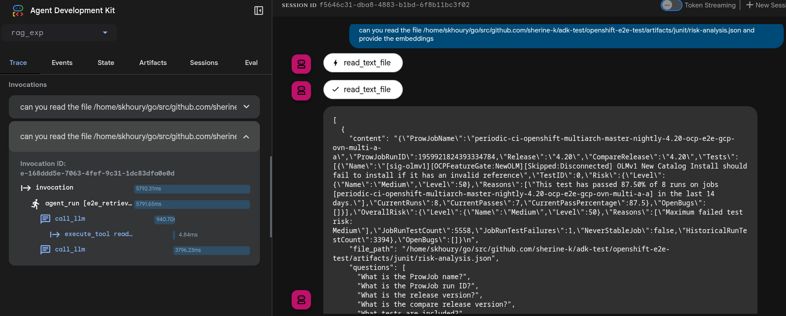

# RAG Experiment

This repo demoes how to use an ADK ([Agent Development Kit](https://google.github.io/adk-docs/get-started)) Agent to chunk a file, or folder structure, and to prepare embeddings based on [Hypothetical questions strategy](https://pixion.co/blog/rag-strategies-hypothetical-questions-hyde). 
This can be used in order to store the embeddings later in a vector database. 
Another agent can use these embeddings to search the database for answers on behalf of an end user, instead of looking into all the files. 

## How to use

* Follow [ADK instructions](https://google.github.io/adk-docs/get-started/installation/) to install adk.
* pull the repo
```
git clone https://github.com/sherine-k/rag_exp
```
* include your GOOGLE_API_TOKEN in the .env file
* include the JUNIT_FOLDER variable in .env file, pointing to the folder that you need the agent to work on (defaults to the `junit` folder here )
* run `adk web`
* go to http://localhost:8000/dev-ui/?app-rag_exp




